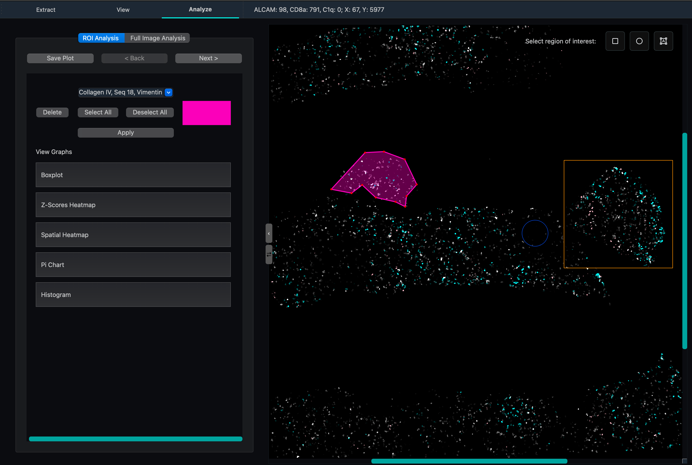

Analysis Tab
============

The Analysis tab provides statistical and visual analysis tools for exploring protein expression data within specific regions of interest (ROIs). Draw regions on the canvas, select proteins, and generate a range of visualizations — all without leaving the application.

.. note::
   Save a screenshot of the Analysis tab to ``docs/source/_static/analysis_tab.png`` to display it here.

Interface Overview
------------------

The Analysis tab has two main sections:

1. **Navigation Controls**: Back/Next buttons for moving between ROIs, plus removing ROIs.
2. **Content Area**: For each ROI, you are able to filter and visualize a variety of different plots.

Region of Interest (ROI) Selection
------------------------------------

ROIs are drawn directly on the canvas in the View tab using the selection tools. Each drawn region becomes a separate analysis view navigable within the Analysis tab.

**Selection tools** (also accessible via keyboard shortcuts):

* **Rectangle** — ``R``
* **Circle** — ``C``
* **Polygon/Lasso** — ``L``

Each ROI is shown with a color indicator and displays its spatial bounds. Use the **Delete** button to remove the current ROI.

.. dropdown:: How region filtering works

   When a region is drawn, cells whose centroids fall within the region geometry are selected:

   * **Rectangle**: cells within the coordinate bounding box.
   * **Circle**: cells satisfying ``(x-cx)² + (y-cy)² ≤ r²`` (circular distance from center).
   * **Polygon**: cells tested using a ray casting algorithm — a ray is cast from the centroid; an odd number of boundary crossings means the point is inside.

Navigating Multiple ROIs
------------------------

* **Back / Next**: Step through all drawn ROIs.
* **Save Plot**: Save the currently displayed visualization as an image file.

Protein Selection
-----------------

For each ROI, choose which proteins to include in the analysis:

* **Protein Selection Dropdown**: Multi-select — choose any combination of available protein channels.
* **Select All / Deselect All**: Quickly toggle all proteins.
* Click **Apply** to regenerate all visualizations for the selected protein set.

Visualizations
--------------

Six visualization types are available for each ROI. Each can be expanded into a separate window for side-by-side comparison.

Box Plot
^^^^^^^^

Shows the distribution of expression levels for each selected protein within the ROI:

* Center line: median expression
* Box: interquartile range (IQR, 25th–75th percentile)
* Whiskers: 1.5× IQR
* Points: outliers beyond the whiskers

Z-Score Heatmap
^^^^^^^^^^^^^^^

Displays standardized expression values across proteins and cells. Each value is the number of standard deviations from the protein's mean across all cells in the ROI. Useful for identifying proteins with unusually high or low relative expression.

Spatial Heatmap
^^^^^^^^^^^^^^^

Maps the spatial distribution of protein expression within the ROI. Custom intensity thresholds can be set per protein to highlight expression hotspots and spatial gradients.

Pie Chart
^^^^^^^^^

Shows the proportion of cells exceeding an expression threshold for each selected protein. Useful for understanding the cellular composition of a region in terms of which proteins are most broadly expressed.

Histogram
^^^^^^^^^

Displays the frequency distribution of expression values for each selected protein. Outlier trimming is applied to focus on the main distribution. Useful for identifying bimodal populations or skewed expression.

Working with Visualizations
---------------------------

* **Expand to New Window**: Open any visualization in a separate window for detailed viewing or side-by-side comparison.
* **Return to Graph List**: Go back to the main list of available visualizations for the current ROI.

Full Image Analysis
-------------------

In addition to ROI-based analysis, the Analysis tab supports analysis across the entire loaded dataset — not just a drawn region. This mode uses all cells in the loaded cell data file, making it useful for whole-image UMAP projections.

UMAP
^^^^

Projects the high-dimensional protein expression data into 2D using Uniform Manifold Approximation and Projection (UMAP). Each point is a cell; proximity in the plot reflects similarity in expression profile. Clusters in the UMAP often correspond to cell subtypes or states.

.. dropdown:: How it works

   UMAP constructs a high-dimensional graph of cell-to-cell similarities based on their protein expression vectors, then optimizes a low-dimensional (2D) layout that preserves the local and global structure of that graph. The result is a 2D scatter plot where cells with similar expression profiles appear close together. Unlike PCA, UMAP preserves non-linear structure and is well-suited for identifying discrete cell populations.

**Parameters**:

.. list-table::
   :header-rows: 1
   :widths: 30 15 55

   * - Parameter
     - Default
     - Description
   * - Normalization Method
     - Log1p
     - Pre-processing applied to expression values before UMAP. **Log1p** applies log(1+x) to compress dynamic range. **Z-Score** standardizes each protein to zero mean and unit variance.
   * - PCA Components
     - 5
     - Number of principal components used to reduce dimensionality before UMAP. Increase for datasets with many proteins; decrease if overfitting noise.
   * - UMAP Neighbors
     - 15
     - Number of neighboring cells considered when constructing the high-dimensional graph. Lower values emphasize local structure; higher values capture more global relationships.
   * - Min Distance
     - 0.10
     - Minimum distance between points in the 2D embedding. Lower values allow tighter clusters; higher values spread points more evenly.
   * - Clustering Resolution
     - 0.30
     - Granularity of Leiden clustering. Higher values produce more, smaller clusters; lower values produce fewer, broader clusters.
   * - Top Proteins Count
     - 5
     - Number of top differentially expressed proteins shown per cluster in the cluster summary view.

Typical Workflow
----------------

1. In the View tab, draw one or more ROIs using the selection tools.
2. Switch to the Analysis tab and select the proteins of interest.
3. Click **Apply** to generate visualizations.
4. Step through ROIs with **Back / Next** to compare regions.
5. Expand plots into separate windows for readability.
6. Click **Save Plot** to export graph.

Usage Tips
----------

* Use the polygon lasso to trace irregular tissue structures or specific anatomical compartments.