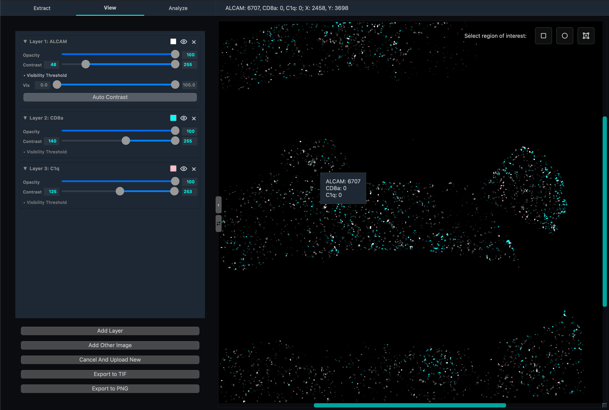

View Tab
========

The View tab provides visualization and exploration capabilities for protein expression data and multi-channel microscopy images. Researchers can layer multiple protein channels, adjust display properties per layer, and select regions for downstream analysis.

Interface Overview
------------------

The View tab consists of two main sections:

1. **Layer Control Panel** (left): Manage individual protein/image layers and their display properties.
2. **Visualization Canvas** (right): The combined image with interactive region selection tools.

Loading Data
------------

Before adding visualization layers, load your processed data:

1. **Open Image**: Load the cell segmentation image output from the Extract tab (typically a StarDist PNG or TIFF mask).
2. **Open Cell Data**: Load the per-cell protein expression CSV or Excel file produced by Quantification.
3. **Scale Down Factor**: Reduce the image resolution for performance when working with very large images.
4. Click **Apply** to prepare the data for visualization.

Layer Management
----------------

Add Layer
^^^^^^^^^

The **Add Layer** button lets you select a protein channel from your loaded cell data and add it to the canvas as a new visualization layer. Each protein channel is displayed independently and can be manipulated without affecting others.

Add Other Image
^^^^^^^^^^^^^^^

Use this button to import an external image (PNG, JPG, TIFF) as an additional overlay layer. Useful for adding reference images, brightfield overlays, or annotations.

Layer Controls
^^^^^^^^^^^^^^

Each layer has its own control panel:

.. list-table::
   :header-rows: 1
   :widths: 20 80

   * - Control
     - Description
   * - Opacity
     - Slider (0–100%). Adjusts transparency so underlying layers remain visible.
   * - Contrast
     - Dual-slider for minimum and maximum intensity thresholds. Values below the minimum appear black; values above the maximum are shown at full brightness. Narrow the range to reveal faint signals.
   * - Tint Color
     - Opens a color picker. Apply a color tint to the grayscale channel data. Common choices: red, green, blue (primary), cyan, magenta, yellow (complementary), or custom.
   * - Visibility
     - Toggle button to show or hide a layer without removing it. Useful for comparing expression patterns.
   * - Visibility Threshold
     - Hides cells not within quantile range. Useful for sepearting high/low populations. Use auto contrast after adjust threshold to see clearer view of low populations.
   * - Delete Layer
     - Permanently removes the layer from the stack.

Region Selection Tools
^^^^^^^^^^^^^^^^^^^^^^

In the top-right corner of the canvas, selection tools let you define regions of interest that feed into the Analysis tab:

* **Rectangle Selection** (shortcut: ``R``)
* **Circle Selection** (shortcut: ``C``)
* **Polygon/Lasso Selection** (shortcut: ``L``)

Export
------

Export the current canvas view as an image file:

* **Export to PNG**: Saves a flattened RGB rendering of all visible layers with current opacity, contrast, and tint settings applied.
* **Export to multi-channel TIFF**: Saves each layer as a separate channel in a multi-channel TIFF file, preserving the full intensity range with applied contrast settings.

UMAP Launcher
-------------

The UMAP dimensionality reduction visualizer can be launched from the View tab. This opens the UMAP interface which projects the per-cell, multi-protein expression data into a 2D plot for cluster exploration. See the :doc:`analysis` page for full details on the UMAP visualization.

.. dropdown:: Technical details

   **JIT Compilation**: The protein layer rendering algorithm uses just-in-time compilation to maximize performance when compositing many layers.

   **Contrast adjustment**: Uses percentile-based intensity windowing. The raw pixel values are not modified — only the display mapping is adjusted.

   **Layer compositing**: Alpha compositing blends multiple protein layers. Layers higher in the stack render on top with their opacity applied first.

   **Color mapping**: Tint colors are applied by multiplying each channel of the grayscale image by the selected RGB tint vector.

Usage Tips
----------

* Assign complementary colors to proteins that co-localize (e.g. red + cyan) so overlap appears as a distinct hue.
* For faint signals, narrow the contrast range (move both sliders toward the signal peak) to make them more visible.
* Toggle visibility on and off to compare channel-by-channel without rearranging layers.
* Use **Scale Down Factor** for initial exploration on large images; switch to full resolution before exporting.
